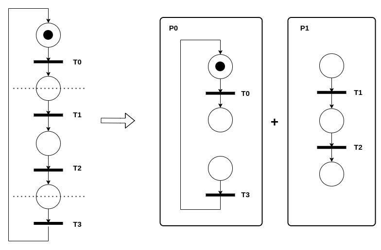
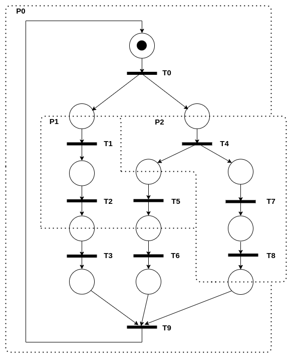
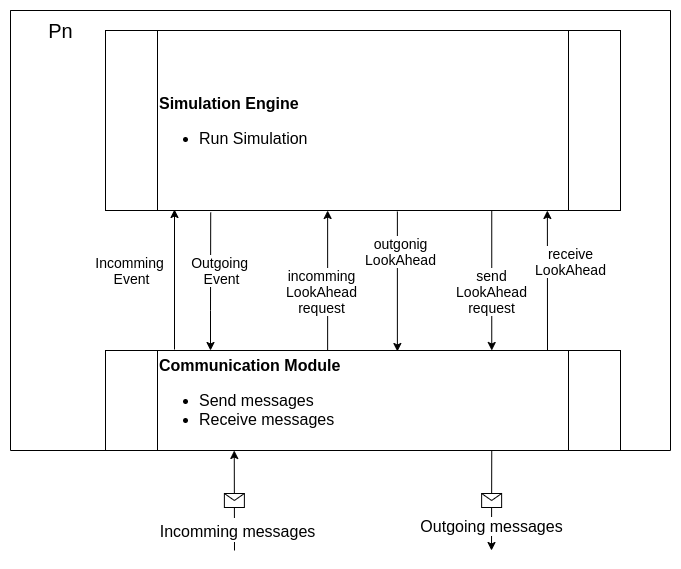

# Distributed Petri Net Simulator

This project consists of a distributed simulator of pretri networks, which uses a conservative synchronization strategy (using lookaheads). The project was built on a centralized simulation engine provided in the course '[Distributed Systems and Networking](https://estudios.unizar.es/estudio/asignatura?anyo_academico=2019&asignatura_id=62223&estudio_id=20190683&centro_id=110&plan_id_nk=534)' at the 'Universidad de Zaragoza'.

The final result is a network of processes that simulate the propagation of events in a Petri net. Each process contains a fragment of the network (subnetwork), simulates the events corresponding to that subnetwork, and propagates the events corresponding to other fragments. The generated events are saved in flat files using the Golang 'log' module and the vector clock library [GoVector](https://github.com/DistributedClocks/GoVector), both logs allow verifying the correct execution of the simulation.

## System Design 

The objective is to create a simulator capable of taking a Petri net, fragmented into $n$ subnets, and processing it in a distributed way, dividing the subnets into $n$ logical processes.

The conservative synchronization strategy using lookaheads is applied to avoid deadlocks while ensuring simulation correctness, even when simulating complex networks.

Based in this requirements, two modules were defined to compose the architecture of each process.

If you need more information related to this project, don't hesitate to contact me.